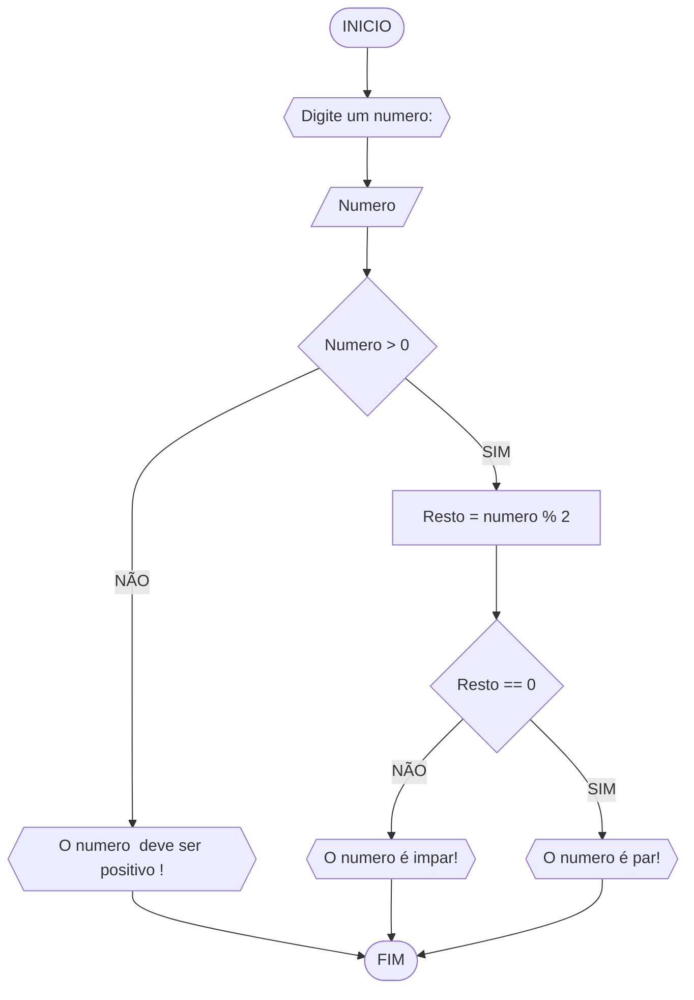

# UNIFOR
**Disciplina**: Raciocínio Logico Algoritmo
**Orientador**: Professor. Ricardo Carubbi 
## LISTA DE EXERCICIOS
## Exercício 3 
Represente, em fluxograma e pseudocódigo, um algoritmo para determinar se um numero inteiro e positivo é par ou impar.   
#### 	Fluxograma


#### Pseudocodigo 

```
1  ALGORITMO verificar_par_impar
2  DECLARE numero, resto NUMERICO
3  ESCREVA "Digite um numero; "
4  LEIA numero
5  SE numero > 0 ENTAO
6    resto = numero % 2 
7    SE resto == 0 ENTAO 
8        ESCREVA "O numero é par!"
9    SENAO
10       ESCREVA "O numero é impar"
11  SENAO
12       ESCREVA "O numero deve ser positivo"
13  FIM_ALGORITIMO 
```
